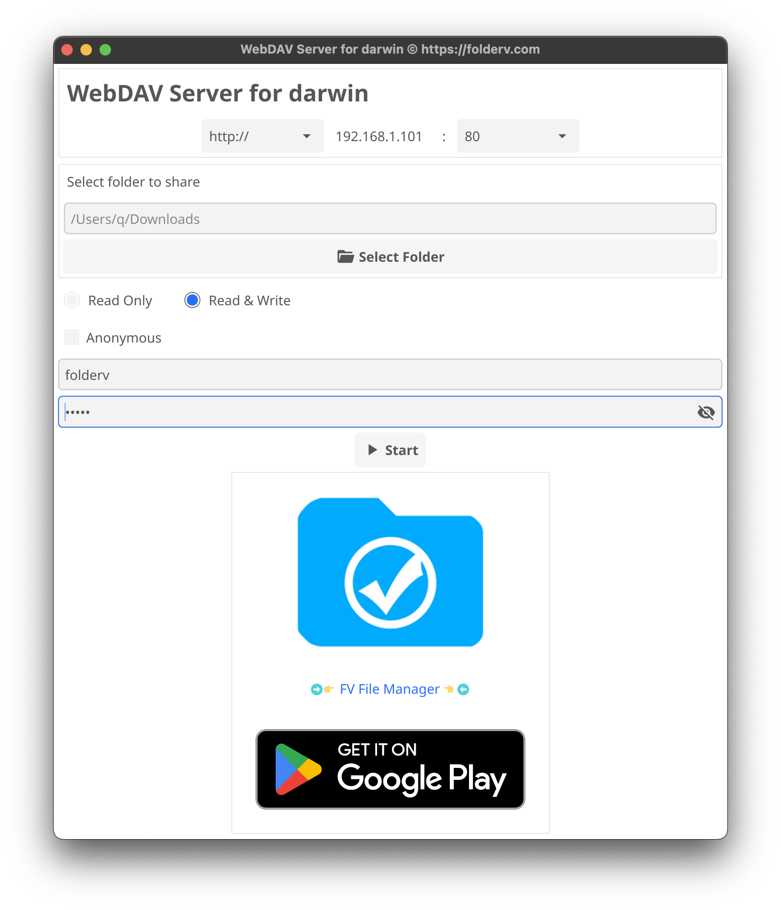
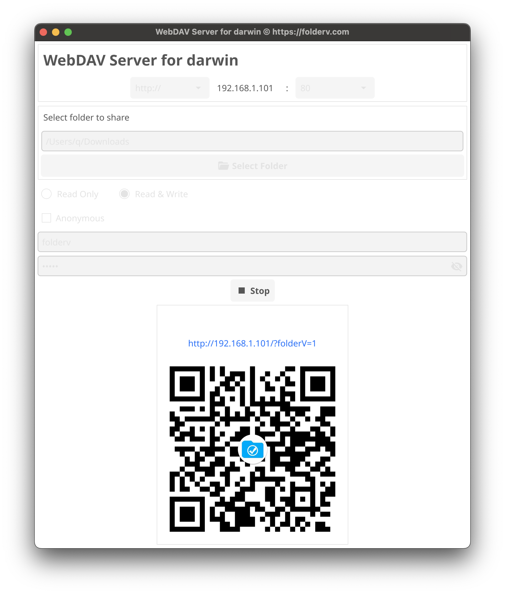

# Simple WebDAV Server

For Windows:

 [SimpleWebDAVServerForWindows.zip](SimpleWebDAVServerForWindows.zip) 

For macOS:

 [SimpleWebDAVServerForMacOS.zip](SimpleWebDAVServerForMacOS.zip) 

For Linux:

 [SimpleWebDAVServerForLinux.tar.xz](SimpleWebDAVServerForLinux.tar.xz) 
